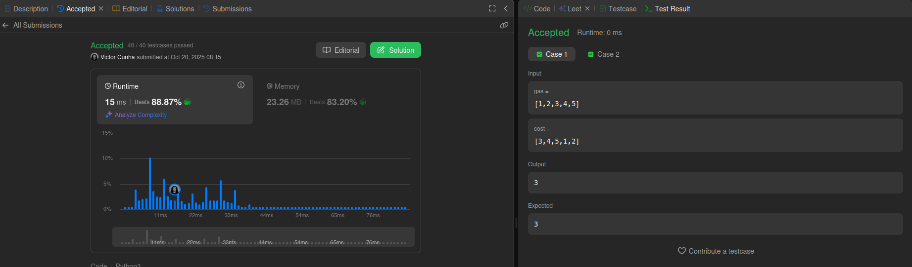
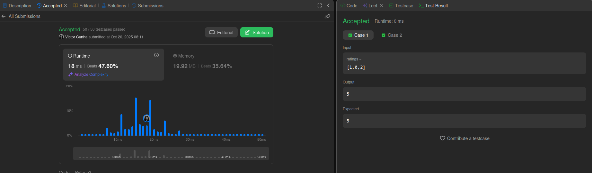
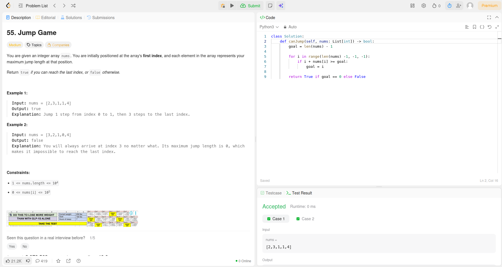

# Greed-Dupla-55

Temas:
 - Algoritmos ambiciosos

**Número da Lista**: 3<br>
**Conteúdo da Disciplina**: Algoritmos ambiciosos <br>

## Alunos
|Matrícula | Aluno |
| -- | -- |
| 21/1031520 |  Victor Hugo da Cunha Santos |
| 23/1037665 |  Daniel Rodrigues Nascimento |

## Sobre 
Resolução de exercícios do CodeForces/LeetCode/AtCoder/HackerRank de acordo com as condições
propostas pelo professor em sala de aula.


## Exercícios
|Exercício | Resolução | Dificuldade |
| -- | -- | -- |
| [GasStation](https://leetcode.com/problems/gas-station/description/) | [gas_station.py](https://github.com/projeto-de-algoritmos-2025/Greed-D55/tree/main/gas_station.py) | Média |
| [Candy](https://leetcode.com/problems/candy/) | [candy.py](https://github.com/projeto-de-algoritmos-2025/Greed-D55/tree/main/candy.py) | Difícil |
| [JumpGame](https://leetcode.com/problems/jump-game/description/) | [jumpGame.py](https://github.com/projeto-de-algoritmos-2025/Greed-D55/tree/main/jumpGame.py) | Média |


## Vídeo
|Vídeo de explicação|
|--|
| [Clique aqui](https://youtu.be/qoRpstJjjG4) |


## Screenshots
- *GasStation*
<div align="center">
	
</div>

- *Candy*
<div align="center">
	
</div>

- *Jump Game*
<div align="center">
	
</div>


## Instalação 
**Linguagem**: <br>
- Python

## Uso 
- Ter o Python 3 instalado na máquina
- Para rodar a resolução do exercício BFSShortestReach:

```bash
python nome_do_arquivo.py
```

## Outros 
Quaisquer outras informações sobre seu projeto podem ser descritas abaixo.
